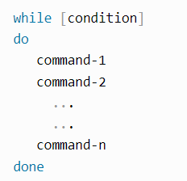

[](https://classroom.github.com/online_ide?assignment_repo_id=8488231&assignment_repo_type=AssignmentRepo)
[TP2 :]{.ul}

# Table des matières 

[Exercice 1 : Variable d'environnement :
2](#exercice-1-variable-denvironnement)

[Exercice 2 : Contrôle de mot de passe :
3](#exercice-2-contrôle-de-mot-de-passe)

[Exercice 3 : Expressions rationnelles :
4](#exercice-3-expressions-rationnelles)

[Exercice 4 : Contrôle utilisateur :
5](#exercice-4-contrôle-utilisateur)

[Exercice 5 : Factorielle : 6](#exercice-5-factorielle)

[Exercice 6 : Le juste prix : 7](#exercice-6-le-juste-prix)

[Exercice 7 : Statistique : 8](#exercice-7-statistique)

[Documents de support : 10](#_Toc113983961)

[1) Opérateurs de comparaison de nombre avec la commande test ou les
crochets :
10](#opérateurs-de-comparaison-de-nombre-avec-la-commande-test-ou-les-crochets)

[2) Opérateur booléens de comparaison de nombres :
11](#opérateur-booléens-de-comparaison-de-nombres)

[3) Opérateurs de comparaison : 11](#opérateurs-de-comparaison)

[4) Variables prédéfinies : 12](#variables-prédéfinies)

[5) Exemple d'un boucle FOR : 12](#exemple-dun-boucle-for)

[6) Exemple d'une boucle WHILE : 13](#exemple-dune-boucle-while)

[7) Exemple d'une condition IF et ELSE :
13](#exemple-dune-condition-if-et-else)

# Exercice 1 : Variable d'environnement :


1)  Les commandes tapées par l'utilisateurs sont stockées sur :
    /home/myuser/.bash_history

2)  Il s'agit de la variable \$HOME .

3)  Voici le rôles des différentes variables:

-   \$LANG est la variable qui stocke la langue courante.

-   \$PWD est la variable qui contient le chemin courant.

-   \$OLDPWD l\'ancien chemin courant.

-   \$SHELL le chemin vers la commande shell.

-   \$\_. contient tous les noms de fichier absolu du shell ou du script
    qui a été exécuter.

4)  

5)  Après avoir tapé la commande bash, la variable **MY_VAR** n\'existe
    plus. La commande bash permet de créer un fils au terminal, la
    variable locale n\'est donc pas transféré.

6)  **export MY_VAR=toto**. Après avoir tapé la commande **bash**,
    **printenv MY_VAR** renvoie bien *toto* car les variables
    d\'environnements sont bien transférées.


7)  

8)  

9)  La commande **unset** détruit la variable alors au lieu de vider la
    variable.

10) 

# Exercice 2 : Contrôle de mot de passe :

Avant de commencer nous allons ajouter le chemin vers script à notre
PATH de façon permanente :


Voici le script :

```bash
#!/bin/bash

#mot de passe valide
mdp='benoit123'

#entrer le mot de passe
echo -n "mot de passe : "
read -s mdpchoix

#faire la comparaison entre le mdp de base et celui choisie
if [ "$mdpchoix" = "$mdp" ]; then
        echo "c'est le bon mot de passe"
else
        echo "c'est pas bon!"
fi
```

Voici le résultat, avec le bon et avec le mauvais mot de passe :

{width="5.180555555555555in"
height="1.8888888888888888in"}

# Exercice 3 : Expressions rationnelles :

Notre scripte doit vérifier si le nombre rentré en argument est un
nombre réel.

```bash
#!/bin/bash

if [ "$1" == "" ]; then
    echo Veuillez saisir un paramètre
    exit 1
fi

#function de test
function is_number() {
    re='^[+-]?[0-9]+([.][0-9]+)?$'
    if ! [[ $1 =~ $re ]]; then
        return 1
    else
        return 0
    fi
}

#exécution de la fonction
is_number $1
#test sur le résultat de la fonction
if [ $? == "1" ]; then
    echo "Ce n'est pas un nombre"
else
    echo "C'est un nombre"
fi

```

Notre première condition (if) vérifie si l'argument rentré est bien vide
ou pas.

La fonction is_number permet de comparer l'argument rentré avec re, s'il
sont équivalent alors le nombre est réel(return1), sinon ce n'est pas un
nombre réel (return0).

Is_number \$1 permet de tester la fonction avec la variable \$1 (ici il
s'agit toujours de l'argument rentré).

On ajoute des indications visible sur le terminale pour que
l'utilisateur puisse avoir le résultat de la vérification.

Voici le résultat dans les deux cas possible :


# Exercice 4 : Contrôle utilisateur :

```bash
#!/bin/bash

#Vérification si la chaine est vide
if [ "$1" == "" ]; then
    echo Utilisation : $0 nom_utilisateur
#$0 est la variable bash = nom du fichier
    exit 1
fi


# Vérification que l'utilisateur existe via compgen
if compgen -u | grep -q -w $1 ; then
    echo "L'utilisateur existe"
    exit 0

else
    echo "L'utilisateur n'existe pas"
    exit 1
fi

```

Voici le résultat dans les deux cas possible :


# Exercice 5 : Factorielle :
```bash
#!/bin/bash

# Verification si l'entrée est vide
if [ "$1" == "" ]; then
    echo Veuillez saisir un paramètre
    exit 1
fi

# On initialise le conteur à 1 et la factorielle à 1
count=$1
facto=1

# Tant que le compteur est plus grand que 0 on multiplie, factoriel par le compteur et on le décrémente
while [ $count -gt 0 ]
do
   facto=$(( $facto * $count ))
   count=$(( $count - 1 ))
done

# Afficher le résultat
echo $facto
```

Notre première condition (if) vérifie si l'argument rentré est bien vide
ou pas.


# Exercice 6 : Le juste prix :

```bash
#!/bin/bash

# On définit le nomber aléatoire enter 1000 et 1
nombre=$((RANDOM % 1000 + 1))

# Tant que nombre différent de  choix alors on fait la vérification
while [ 1 -eq 1 ]; do

    # Récupération de la saisie
    echo -n "Votre nombre : "
    read choix

    # Si jamais le nombre est plus petit on l'affiche
    if [ $choix -gt $nombre ]; then
        echo "C'est plus petit que ça !"

    #Si jamais le nombre est plus grand on l'affiche
    elif [ $choix -lt $nombre ]; then
        echo "C'est plus grand que ça !"

    # Si jamais le nombre a été trouvé on l'affiche et on quitte la boucle
    else
        echo "Bravo, vous avez trouvé ! C'était bien $nombre"
        break
    fi
done

```

Voici le résultat avec les 3 cas possibles (petit/grand/OK) :


# Exercice 7 : Statistique :

[Partie 1 :]{.ul}
```bash
#!/bin/bash

# test si jamais il y a 3 arguments
if [ $# -ne 3 ]; then
# $# = nombre de paramètre de ligne de commande on été transmis au script
    echo "attention! 3 arguments sont requis"
    exit 1
fi


#function de test
function is_number() {
    re='^[+-]?[0-9]+([.][0-9]+)?$'
    if ! [[ $1 =~ $re ]]; then
        return 1
    else
        return 0
    fi
}

min=0
max=0
moyenne=0
i=1

for var in "$@"; do
    is_number $var
    # Test si jamais c'est bien un nombre
    if [ $? == "1" ]; then
        echo $var "n'est pas un nombre"
        exit 1

    else
    # Si i=1 alors var = max,min et moyenne car c'est le premier paramètre
        if [ $i -eq 1 ]; then
            min=$var
            max=$var
            moyenne=$((moyenne + $var))
        else
    # Si i n est pas 1 alors on vérifie si var actuel est plus petit que min, si c est le cas alors var=min
            if [ $var -lt $min ]; then
                min=$var
    # Si i n est pas 1 alors on vérifie si var actuel est plus grand que max, si c est le cas alors var = max
            elif [ $var -gt $max ]; then
                max=$var
            fi
    # On le rajoute à la moyenne pour la calculer après
            moyenne=$((moyenne + $var))
        fi

    fi
    i=$((i + 1))
done
#fin de notre boucle for avec le done

# Calcul de la moyenne
i=$((i - 1))
moyenne=$((moyenne / $i))

# Affichage
echo min : $min
echo max : $max
echo moyenne : $moyenne

```

[Partie2 :]{.ul}

Pour banaliser le nombre de paramètre a rentrer il suffit de supprimer
notre vérification sur le nombre de paramètre rentré :


Voici donc le code final:
```bash
#!/bin/bash

#function de test
function is_number() {
    re='^[+-]?[0-9]+([.][0-9]+)?$'
    if ! [[ $1 =~ $re ]]; then
        return 1
    else
        return 0
    fi
}

min=0
max=0
moyenne=0
i=1

for var in "$@"; do
    is_number $var
    # Test si jamais c'est bien un nombre
    if [ $? == "1" ]; then
        echo $var "n'est pas un nombre"
        exit 1

    else
    # Si i=1 alors var = max,min et moyenne car c'est le premier paramètre
        if [ $i -eq 1 ]; then
            min=$var
            max=$var
            moyenne=$((moyenne + $var))
        else
    # Si i n est pas 1 alors on vérifie si var actuel est plus petit que min, si c est le cas alors var=min
            if [ $var -lt $min ]; then
                min=$var
    # Si i n est pas 1 alors on vérifie si var actuel est plus grand que max, si c est le cas alors var = max
            elif [ $var -gt $max ]; then
                max=$var
            fi
    # On le rajoute à la moyenne pour la calculer après
            moyenne=$((moyenne + $var))
        fi

    fi
    i=$((i + 1))
done
#fin de notre boucle for avec le done

# Calcul de la moyenne
i=$((i - 1))
moyenne=$((moyenne / $i))

# Affichage
echo min : $min
echo max : $max
echo moyenne : $moyenne

```

Partie 3 :

```bash
#!/bin/bash

function is_number() {
    re='^[+-]?[0-9]+([.][0-9]+)?$'
    if ! [[ $1 =~ $re ]]; then
        return 1
    else
        return 0
    fi
}

#on déclare notre tableau qui va stocker les chiffres/nombres que nousn allons rentrer
declare -a array

#la boule while demande en boucle de rentrer un argument pour l'ajouter au tableau 
while [ 1 -eq 1 ]; do

    echo "Veuillez rentrer un chiffre/nombre ( tappez ko si vous avez fini): "
    read toto

#si on tappe ko on arrête la boucle while pour passer à la suite
    if [ $toto == "ko" ]; then
        break
    fi

    is_number $toto
    if [ $? == "1" ]; then
        echo " $? n'est pas correcte"
        break
    else
        #on ajoute le dernier argument au tableau
        array+=($toto)
    fi

done

#On affiche le tableau avec les valeurs rentrées
echo ${array[@]}

min=0
max=0
moyenne=0
i=1


#pour var compris dans notre tableau de valeur
for var in "${array[@]}"; do
    is_number $var
    # Test si jamais c'est bien un nombre
    if [ $? == "1" ]; then
        echo $var "n'est pas correcte"
        exit 1

    else
    # Si i=1 alors var = max,min et moyenne car c'est le premier paramètre
        if [ $i -eq 1 ]; then
            min=$var
            max=$var
            moyenne=$((moyenne + $var))
        else
    # Si i n est pas 1 alors on vérifie si var actuel est plus petit que min, si c est le cas alors var=min
            if [ $var -lt $min ]; then
                min=$var
    # Si i n est pas 1 alors on vérifie si var actuel est plus grand que max, si c est le cas alors var = max
            elif [ $var -gt $max ]; then
                max=$var
            fi
    # On le rajoute à la moyenne pour la calculer après
            moyenne=$((moyenne + $var))
        fi

    fi
    i=$((i + 1))
done
#fin de notre boucle for avec le done

# Calcul de la moyenne
i=$((i - 1))
moyenne=$((moyenne / $i))

# Affichage
echo min : $min
echo max : $max
echo moyenne : $moyenne

```


[]{#_Toc113983961 .anchor}Documents de support :

Pour ce TP, j'ai utilisé des ressources pour comprendre et réutiliser
certaines commandes, boucles (for ou while), conditions(else, if) ou
variables.

## [1) Opérateurs de comparaison de nombre avec la commande test ou les crochets :]{.ul} 


## [2) Opérateur booléens de comparaison de nombres :]


## [3) Opérateurs de comparaison :]


## [4) Variables prédéfinies :]


## [5) Exemple d'un boucle FOR :]


-   **\#!/bin/bash** -- montre que le code est un script bash.

-   **i** -- est un caractère de remplacement pour une variable. En
    revanche, \$i est la valeur individuelle de la variable. Nous
    pouvons également l'écrire sous la forme c/\$c ou sous n'importe
    quel autre nom.

-   **in** -- sépare la variable et les éléments qui suivent.

-   **1 2 3 4 5** -- est un exemple d'éléments sur lesquels nous voulons
    exécuter l'instruction

-   **do** -- est le mot-clé qui déclenche les boucles. Il exécutera
    ensuite l'instruction n fois, n'étant le nombre total d'éléments.
    Ici, la valeur de n est de 5.

-   **echo "Hello: \$i"** -- est le code que nous allons répéter n fois.
    N'oublions pas que les guillemets transforment tout ce qui se trouve
    à l'intérieur en une variable.

-   **done** -- arrête la boucle.

## [6) Exemple d'une boucle WHILE :]



Ici, la condition représente l'état qui doit être vérifié à chaque fois
avant d'exécuter des commandes dans la boucle.

Si la condition est *vraie*, nous exécutons les instructions dans la
boucle.

Si la condition est *fausse*, nous sortons de la boucle. Les
instructions de command-1 à command-n sont des instructions exécutées
dans une boucle jusqu'à ce que la condition devienne fausse.

ATTENTION aux boucles infinies : Si la condition ne peut pas/plus
changer (ce qui permettrai en temps normale de passer à la suite) alors
a boucle se répète indéfiniment.

## [7) Exemple d'une condition IF et ELSE :]{.ul}


-   expression : est un ensemble d'une ou plusieurs conditions

-   command_list1 : est une liste de commandes exécutées si l'expression
    est *true*

-   command_list2 : liste des commandes exécutées si l'expression est
    *false*
